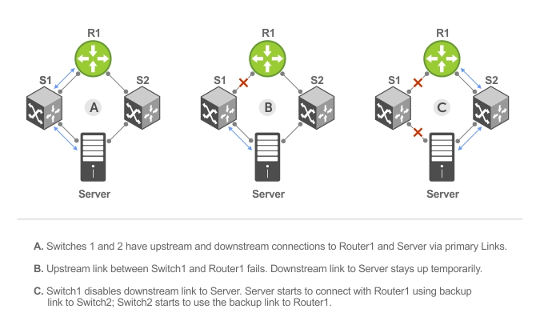

# Uplink Failure Detection (UFD)

!!! info "Feature Description"

    Uplink failure detection (UFD) provides detection of the loss of upstream connectivity and, if used with network interface controller (NIC) teaming, automatic recovery from a failed link. A switch provides upstream connectivity for devices, such as servers. If a switch loses its upstream connectivity, downstream devices also lose their connectivity. However, the devices do not receive a direct indication that upstream connectivity is lost because connectivity to the switch is still operational. UFD allows a switch to associate downstream interfaces with upstream interfaces. When upstream connectivity fails, the switch disables the downstream links. Failures on the downstream links allow downstream devices to recognize the loss of upstream connectivity.

For example, as shown below, Switches S1 and S2 both have upstream upstream connectivity to Router R1 and downstream connectivity to the server. UFD operation is shown in Steps A through C:

- In Step A, the server configuration uses the connection to S1 as the primary path. Network traffic flows from the server to S1 and then upstream to R1.
- In Step B, the upstream link between S1 and R1 fails. The server continues to use the link to S1 for its network traffic, but the traffic is not successfully switched through S1 because the upstream link is down.
- In Step C, UFD on S1 disables the link to the server. The server then stops using the link to S1 and switches to using its link to S2 to send traffic upstream to R1.



## UFD and NIC Teaming

To implement a rapid failover solution, you can use uplink failure detection on a switch with network adapter teaming on a
server. For example, as shown previously, the switch/ router with UFD detects the uplink failure and automatically disables the
associated downstream link port to the server. To continue to transmit traffic upstream, the server with NIC teaming detects
the disabled link and automatically switches over to the backup link in order.

## Configuring UFD

1. Create an uplink-state group and enable the tracking of upstream link on the switch/router.
2. Assign a port or port-channel to the uplink-state group as an upstream or downstream interface.
3. Configure the number of downstream links in the uplink-state group that will be disabled if one upstream link in the group goes down.
4. Enable auto-recovery so that UFD-disabled downstream ports in the uplink-state group come up when a disabled upstream port in the group comes back up.
5. (Optional) Disable upstream-link tracking without deleting the uplink-state group.

```shell
DellEMC(conf)# uplink-state-group 1 #(1)
DellEMC(conf-uplink-state-group-1)# upstream FortyGigabitEthernet 1/51
DellEMC(conf-uplink-state-group-1)# downstream TenGigabitEthernet 1/1
DellEMC(conf-uplink-state-group-1)# downstream disable links all 
DellEMC(conf-uplink-state-group-1)# downstream auto-recover #(2)
DellEMC(conf-uplink-state-group-1)# no enable #(3)
```

1. The uplink-state group ID can be any number from 1 to 16.
2. The `auto-recovery` setting is enable by default, but included here for reference. It enables the automatic bring up of disabled downstream ports when the upstream port comes back up.
3. This is useful for testing/troubleshooting. UFD can be turned on or off without removing the config. Turn tracking back on with `enable`.

!!! info "Points to Remember"

    - You can assign an interface to only one uplink-state-group. Configure each interface assigned as eiter an upstream or downstream interface, but not both.
    - You can assign individual member ports of a port-channel *or* the port-channel itself, but not both.
    - To enable debug messages for UFD events, use the `debug uplink-state-group [group-id]` command.

!!! tip "UFD in reverse!"

    UFD can be configured in reverse as well. Just assign upstream ports as downstream ports in the uplink-state group and vice versa.

[*Reference*](https://www.dell.com/support/manuals/en-us/dell-emc-os-9/s4048-on-9.14.2.4-config/configuring-uplink-failure-detection?guid=guid-2aab7b9f-0b01-4061-b9dc-62ab3f302688&lang=en-us)