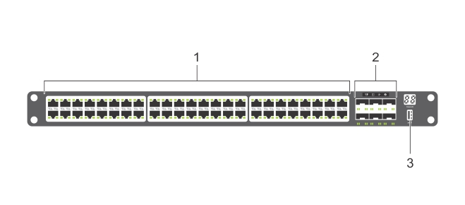

# Overview

> This page was last updated: *{{ git_revision_date_localized }}*

[Configuration Guide for the S4048-ON System (9.14.2.4)](https://www.dell.com/support/manuals/en-us/dell-emc-os-9/s4048-on-9.14.2.4-config/about-this-guide)

!!! info

    S4048-ON is a networking switch for campus aggregation and core switching 10 Gbps servers and 40 Gbps optical uplinks to the 40 Gbps switching fabric in the core.

    The S4048-ON has:

    - Forty-eight SFP+ ports for 1/10 Gbps transceivers
    - Six fixed QSFP+ optical ports for 40Gbps transceivers
    - Serial RS 232 and Micro-USB console ports
    - One out-of-band (OOB) RJ45 management port
    - LED display for the switch, fan, and power status

---

## Front View (I/O-side)

1. SFP+ ports
2. QSFP+ ports
3. USB Type-A storage port

## Rear View (PSU-side)

1. Power supply unit 1
2. Fan module
3. Out-of-band management port
4. Power supply unit 2
5. RS-232 serial console port

## LED Behavior

=== "1. Master LED"

    - **Off**: Switch is in Stacking Slave mode
    - **Solid green**: System is in Stacking Master or Standalone mode

=== "2. System LED"

    - **Solid green** : Normal operation
    - **Flashing green**: Booting
    - **Solid amber**: Critical system error
    - **Flashing amber**: Non-critical system error, fan failure, or power supply failure

=== "3. Power LED"

    - **Off**: No power
    - **Solid green**: Normal
    - **Solid amber**: POST is in process
    - **Flashing amber**: Power supply failed

=== "4. Fan LED"

    - **Solid green**: Fan powered and running at the expected RPM
    - **Solid amber**: Fan failed including incompatible airflow direction when you insert the PSU or fan trays with differing airflows

=== "5. Locator LED"

    - **Off**: Locator function is disabled
    - **Flashing blue**: Locator function is enabled

=== "6. SFP+ link/activity LEDs"

    - Standard activity/speed indicators

=== "7. Stack LED"

    - Green digit display: Stack ID

=== "8. USB port LED"

    . . .

=== "9. QSFP+ link/activity LEDs"

    - **Activity LED flashing amber**: One second on, one second off - port beacon.

## Accessing the CLI

The S4048-ON does not listen to any network out of the box, so you'll need to access the CLI via a console port for initial configuration. The easiest way is to use the micro-usb port on the front of the device.

Download the [drivers](https://www.dell.com/support/home/en-us/drivers/driversdetails/?driverid=r5k9d) onto the device you'll be using for access and then connect to the switch using the following settings:

- Baud rate: 115200
- No parity
- 8 data bits
- 1 stop bits
- No flow control

[*Reference*](https://www.dell.com/support/manuals/en-us/force10-s4048-on/s4048_on_install_pub_test/micro-usb-b-console-port-access?guid=guid-e83dcac3-c738-45b7-8fd9-a0919e20d92a&lang=en-us)

!!! note

    To [use the RS-232 console port](https://www.dell.com/support/manuals/en-us/dell-emc-os-9/s4048-on-9.14.2.4-config/accessing-the-console-port?guid=guid-894f99b1-5209-4246-b75c-116c3bb5568e&lang=en-us) on the back, you'll need a rollover cable (RJ45 with a DB-9 Adapter).

---

[OS9 CLI Configuration Docs](../../dell-emc/S4048-ON/os9.md){ .md-button } [OS10 CLI Configuration Docs](../../dell-emc/S4048-ON/os10.md){ .md-button }
