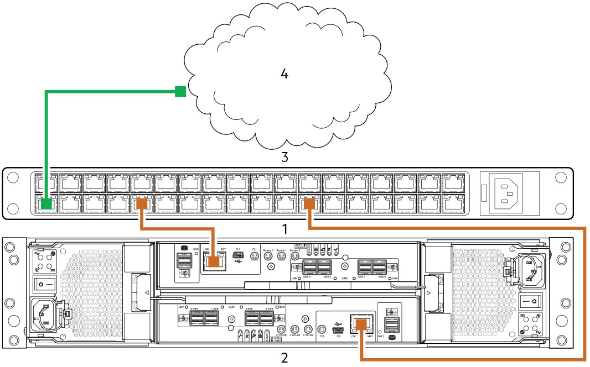
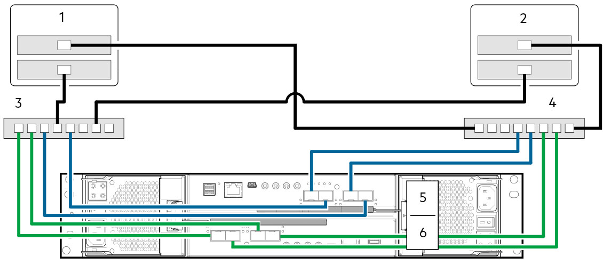
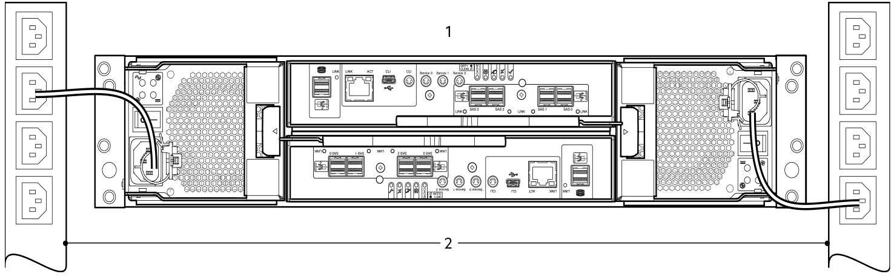

# Deployment Brief

!!! info "Required Tools"

    - Phillips screwdriver
    - Torx T20 bit for locks

1. Unpack.
2. Install the controller enclosure and optional expansion enclosure in the rack.
3. Populate drawers with disks (DDICs). 2U encosures ship with disks installed.
4. Cable the optional expansion enclosures.
5. Connect the management ports.
6. Cable the controller host ports.
7. Connect the power cords and power on the system.
8. Perform system and storage setup.
9. Perform host setup.
      1. Attach host servers.
      2. Install required host software.
10. Perform the initial configuration tasks.

## Connect the management ports

1. Connect an Ethernet cable to the network port on each controller module.
2. Connect the other end of each Ethernet cable to a network that your management host can access, preferably on the same subnet.

1. Controller module in Slot A
2. Controller module in Slot B
3. Switch
4. SAN

!!! note

    See also the topic on [configuring network ports](me4-overview.md#set-the-network-port-ip-addresses-via-dhcp) on controller modules.

## Cable the controller host ports (iSCSI)

A host identifies an external port to which the storage system is attached. The external port may be a port in an I/O adapter (such as an FC HBA or ethernet NIC) in a server.

!!! note

    - Controller modules are not always shipped with preinstalled SFP+ transceivers. You might need to install SFP transceivers into the controller modules.
    - Use the PowerVault Manager to set the host interface protocol for CNC ports using qualified SFP+ transceivers. ME4 Series modules ship with CNC ports configured for FC, so you must configure these ports for iSCSI when connecting to iSCSI hosts.
    - If you are using switches with mixed traffic (LAN/iSCSI), then a VLAN should be created to isolate iSCSI traffic from the rest of the switch traffic.

To connect controller modules supporting 10 GbE iSCSI host interface ports to a server HBA/NIC or switch, using the controller CNC ports, select a qualified 10 GbE SFP+ transceiver.

Use the cabling diagram below to connect host servers to a switch-attached storage system.

1. Host server A
2. Host server B
3. Switch A
4. Switch B
5. Controller module in Slot A
6. Controller module in Slot B

!!! note

    Take note of how the CNC ports are connected to the switches. The reason for doing so is that each pair of ports (A0,A1 or A2,A3) are connected to a dedicated CNC chip. If you are not using all four ports on a controller, it is best to use one port from each pair (A0,A2) to ensure better I/O balance on the front end.

## Connecting the power cords and powering on the system

Connect the power cable from each PCM on the enclosure rear panel to the power distibution unit as shown below:

- Power on the storage system by connecting the power cables from the PCMs to the PDU, and moving the power switch on each PCM to the On posisition.
    - With 2U enclosures, the System Power LED on the 2U Ops panel lights green when the enclosure power is activated.
- When powering up, ensure to power up the enclosures and associated data host in the following order:
    1. Drive enclosures—Ensures that the disks in the drive enclosure have enough time to completely spin up before being scanned by the controller modules within the controller enclosure. The LEDs blink while the enclosures power up. After the LEDs stop blinking the power-on sequence is complete. If the LEDs on the front and back of the enclosure are amber then a fault has been detected.
    2. Controller enclosure—Depending upon the number and type of disks in the system, it may take several minutes for the system to become ready.
    3. Data host—if powered off for maintenance purposes.
- When powering off, reverse the order of steps that are used for powering on.