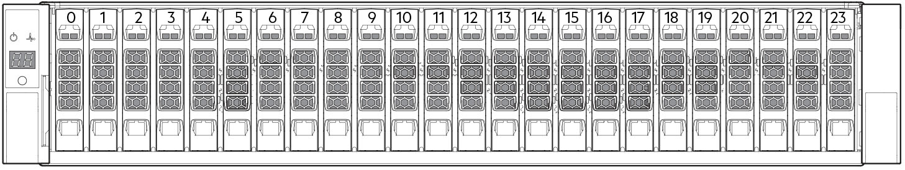

# Overview

!!! info

    The ME4 Series is a next gen entry-level block storage array that’s purpose-built and optimized for SAN/DAS simplicity and accelerated performance. It’s designed to meet the needs of the entry storage market, while also offering the flexibility to scale as needs grow.

    Resources:

    - [Owner's Manual](https://www.dell.com/support/manuals/en-us/powervault-me4012/me4_series_om_pub/)
    - [Deployment Guide](https://www.dell.com/support/manuals/en-us/powervault-me4012/me4_series_dg_pub)
    - [Administrator's Guide](https://www.dell.com/support/manuals/en-us/powervault-me4012/me4_series_ag_pub)
    - [CLI Guide](https://www.dell.com/support/manuals/en-us/powervault-me4024/me4_series_cli_pub) 
    - [Best Practices Guide](https://www.delltechnologies.com/asset/en-us/products/storage/industry-market/dell_emc_me4_series_storage_system_best_practices.pdf)

??? info "PowerVault ME4 Series Terminology"

    `Customer Replaceable Unit (CRU)`

    :   Customer Replaceable Unit. A part that can be replaced by the customer.

    `Field Replaceable Unit (FRU)`

    :   Field Replaceable Unit. A part that requires service expertise from a Dell field technician.

    `Partner Firmware Update (PFU)`

    :   An option that automatically updates the firmware on the second controller module to match that on the first controller module.

    `Converged Network Controller (CNC)`

    :   This technology allows you to select the host interface protocols to use on the storage system. The ME4 Series FC/iSCSI modules use SFP+ connectors in the CNC ports.

    `Storage Bridge Bay (SSB)`

    :   Storage Bridge Bay modules actively manage the enclosure. Each module has a SAS expander with its own storage enclosure processor (SEP).

    `Data Drive in Carriers (DDICs)`

    :   A DDIC consists of a disk drive that is installed in a carrier module. They are hot-swappable.

    `Input/Output Module (IOM)`

    :   An IOM is a module that provides connectivity to the enclosure. More specifically, they are referenced in Dell documentation as expansion enclosures.

    `Power Cooling Module (PCM)`

    :   A PCM is a module that provides power and cooling to the enclosure. It is a hot-swappable module.

---

## Front Panel

### DDICs

!!! info

    Integers on the disks indicate drive slot numbering sequence.



### Operator Panel LEDs


=== "1. System Power"

    - **Constant green**: At least one PCM is supplying power.
    - **Off**: System not operating.

=== "2. Status/Health"

    - **Constant blue**: System is powered on and controller is ready.
    - **Blinking blue**: Controller management is busy.
    - **Constant amber**: Module fault rpesent.
    - **Blinking amber**: Logical fault.

=== "3. Unit ID Display"

    - **Green seven-digit display**: Shows the numerical position of the enclosure in the cabling sequence. The UID (Unit ID Display) is also the enclosure ID.

=== "4. Identity"

    - **Blinking blue**: System ID locator is activated.
    - **Off**: Normal state

## Rear Panel

!!! info

    Controller modules, IOMs, and PCMs are available as CRUs.

### Controller enclosure (4-port FC/iSCSI)


1. Power cooling module slot 0
2. Power cooling module slot 1
3. Controller module slot A
4. Controller module slot B

### Controller module (4-port FC/iSCSI)

The top slot for holding controller modules is designated slot A and the bottom slot is designated slot B. The face plate details of the controller modules show the modules aligned for use in slot A. In this orientation, the controller module latch shown at the bottom of the module and it is in a closed/locked position. The following figures identify the ports on the controller modules.


1. Back-end expansion SAS port
2. Ethernet port used by management interfaces
3. USB serial port (CLI)
4. 3.5 mm serial port (CLI)
5. 3.5 mm serial ports (service only)
6. Reset
7. CNC ports (ports 3, 2, 1, 0)

### Controller module LEDs


=== "1. Link Status/Activity for host 4/8/16 Gb FC"

    - **Off**: No link.
    - **Green**: Port connected and the link is up.
    - **Blinking green**: I/O activity.

=== "2. Link Status/Activity 10GbE iSCS"

    - **Off**: No link.
    - **Green**: Port connected and the link is up.
    - **Blinking green**: I/O activity.

=== "3. OK"

    - **Green**: Controller operating normally.
    - **Blinking green**: Booting.
    - **Off**: Controlller not, or is powered off.

=== "4. Fault"

    - **Off**: Controller operating normally.
    - **Amber**: Fault detected or service action required.
    - **Blinking amber**: Hardware-controlled power-up or a cache flush or restore error.

=== "5. OK to remove"

    - **Off**: Not prepared for removal.
    - **Blue**: Controller module is prepared for removal.

=== "6. Identity"

    - **White**: Controller is being identified.

=== "7. Cache Status"

    - **Green**: Cache is dirty (contains unwritten data) and operation is normal.
    - **Off**: In a working controller, cache is clean (contains no unwritten data). This is an occasional condition that occurs while the system is booting.
    - **Blinking green**: A CompactFlash flush or cache self-refresh is in progress, indicating cache activity.

=== "8. Network Port Link Active Status"

    - **Off**: The Ethernet link is not established, or the link is down.
    - **Green**: The Ethernet link is up

=== "9. Network Port Link Speed"

    - **Off**: Link is up at 10/100 base-T negotiated speeds.
    - **Amber**: Link is up and negotiated at 1000 base-T.

=== "10. Expansion Port Status"

    - **Off**: The port is empty or the link is down.
    - **Green**: The port is connected and the link is up.

## Accessing the CLI

Embedded within the controller modules is a command-line interface (CLI) that enables you to manage and monitor the storage system. The CLI can be accessed in two ways:

- Use SSH or Telnet on a management host that is remotely connected to a controller module network port through a LAN.
- Use a serial cable to establish a serial connection from a computer to the CLI port on a controller module. Refer back to the [controller module rear panel diagram](#controller-module-4-port-fciscsi) for the location of the CLI ports.

If the default IP addresses (10.0.0.2 - Controller A, 10.0.0.3 - Controller B) are not compatible with your network, you must set an IP addresses for each network port using the CLI.

1. Obtain an IP address, subnet mask and gateway from your network administrator.
2. Connect a 3.5mm/DB9 serial cable from a host computer with a serial port to the 3.5mm stereo plug CLI port on controller A. Alternatively, connect a generic mini-USB cable from a host computer to the USB CLI port on controller A.
3. Start a terminal emulator configured to use the following display and connection settings:
    1. Display Settings:
          - **Terminal emulation mode** - VT-100 or ANSI (for color support)
          - **Font** - Terminal
          - **Translations** - None
          - **Columns** - 80
    2. Connection Settings:
          - **Connector** - COM3
          - **Baud rate** - 115,200
          - **Data bits** - 8
          - **Parity** - None
          - **Stop bits** - 1
          - **Flow control** - None
4. Press `Enter` to display the CLI prompt if necessary.
5. If you are connecting to a storage system with G275 firmware that has not been deployed, the default user/pass is `manage`/`!manage`. If your system has been deployed, login with a user that has the *manage* role.
6. If you are connecting to a storage system with G280 firmware that has not been deployed, type `setup` at the login prompt and press `Enter`. Do not type anything at the password prompt and press `Enter`. If your system has been deployed, login with a user that has the *manage* role.

### Set the network port IP addresses via DHCP

!!! info

    In DHCP mode, the network port IP address, subnet mask, and gateway are obtained from a DCHP server. If a DHCP server is not available, the current network addresses are not changed. To determine the addresses that are assigned to the controller modules, use the list of bindings on the DHCP server.

To obtain an IP address via DHCP, use the `set network-parameters dhcp` command.

### Set the network port IP addresses statically

To use a custom static IP address, use the `set network-parameters ip <address> netmask <netmask> gateway <gateway> controller <a|b>` command. Run the command for controller module A first, and then for controller module B.

Where:

- `<address>` is the IP address of the controller module
- `<netmask>` is the subnet mask
- `<gateway>` is the IP address of the subnet router
- `<a|b>` specifies the controller whose network parameters you are setting

!!! example

    ```shell
    set network-parameters ip 192.168.0.10 netmask 255.255.255.0 gateway 192.168.0.1 controller a
    set network-parameters ip 192.168.0.11 netmask 255.255.255.0 gateway 192.168.0.1 controller b
    ```

### Verifying the new IP addresses and connectivity

Show the IP address, subnet mask and gateway of a controller module: `show network-parameters`

Ping an address, such as the gateway: `ping 192.168.0.1`

From another host, ping the controllers . . .

!!! note

    If you can't access your storage system for at least three minutes after changing the IP address, restart the controllers using the CLI command `restart mc both`.

!!! warning "Caution"

    When configuring an iSCSI storage system or a storage system that uses a combination of Fibre Channel and iSCSI SFPs, do not restart the Management Controller or exit the terminal emulator session until the CNC ports are configured as described [here](https://www.dell.com/support/manuals/en-us/powervault-me4012/me4_series_dg_pub/changing-host-port-settings?guid=guid-4b22aaaa-ca95-4d45-82cd-a3499bb1890c&lang=en-us).

    I couldn't find an explanation for this precaution btw . . .
    