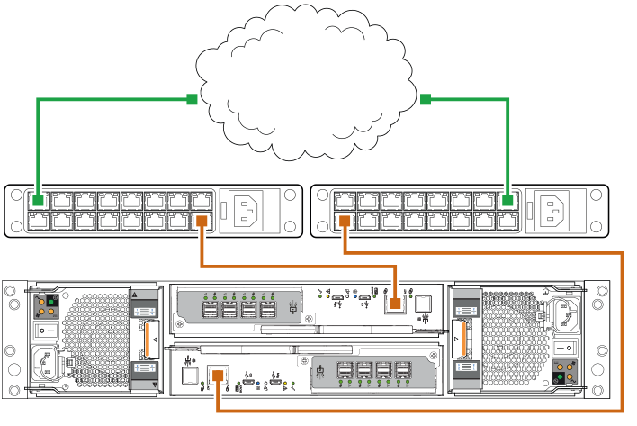
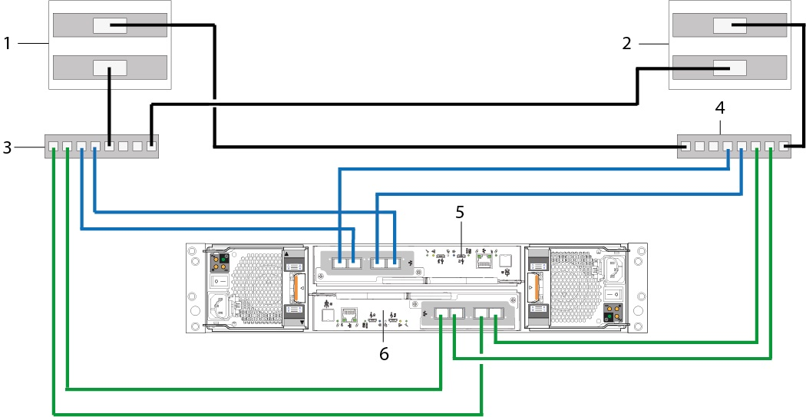
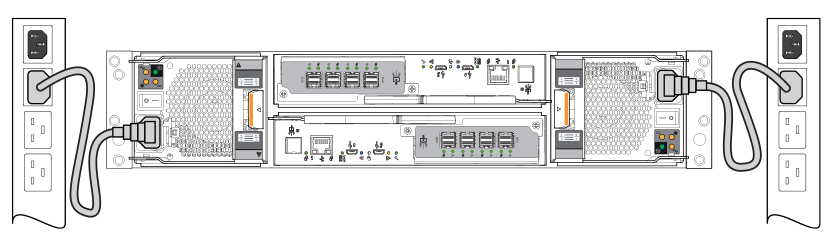

# Deployment Brief

!!! info "Required Tools"

    - Phillips screwdriver
    - Torx T20 bit for locks and CRU replacement

1. Unpack.
2. Install the controller enclosure and optional expansion enclosure in the rack.
3. Populate drawers with disks (DDICs). 2U encosures ship with disks installed.
4. Cable the optional expansion enclosures.
5. [Connect the management ports](#connect-the-management-ports).
6. [Cable the controller host ports](#cable-the-controller-host-ports-iscsi).
7. [Connect the power cords and power on the system](#connecting-the-power-cords-and-powering-on-the-system).
8. [Perform system and storage setup](me5-guided-setup.md#).
9. [Perform host setup](me5-host-setup.md).
    1. Attach host servers.
    2. Install required host software.
10. Perform the initial configuration tasks.

!!! Warning "Operational Safety"

    Operation of the enclosure with modules missing disrupts the airflow and prevents the enclosure from receiving sufficient cooling. For all 2U enclosures, all IOM and PCM slots must be populated. In addition, empty drive slots (bays) in 2U enclosures must hold blank drive carrier modules. For a 5U enclosure, all controller module, IOM, FCM, and PSU slots must be populated.

[*Reference*](https://www.dell.com/support/manuals/en-us/powervault-me5024/me5_series_dg/installation-checklist?guid=guid-7006b52e-72c2-4515-8673-6194698762c2&lang=en-us)

## Connect the management ports

1. Connect an Ethernet cable to the network port on each controller module.
2. Connect the other end of each Ethernet cable to a network that your management host can access, preferably on the same subnet.

[*Reference*](https://www.dell.com/support/manuals/en-us/powervault-me5024/me5_series_dg/connect-to-the-management-network?guid=guid-e1c38f5a-979b-4572-8e37-1416361180c8&lang=en-us)

## Cable the controller host ports (iSCSI)

!!! info

    The Dell ME5 Series [Support Matrix doc](https://dl.dell.com/content/manual40533481-dell-powervault-me5-series-storage-system-support-matrix.pdf) states that if the iSCSI initiators are connected to ME5 Series storage systems through network switches, [flow control must be enabled on all switch ports](../S4048-ON/os9-other.md#flow-control-for-iscsi) and [server NIC ports](https://learn.microsoft.com/en-us/powershell/module/netadapter/set-netadapteradvancedproperty?view=windowsserver2019-ps#example-1-set-the-value-of-an-advanced-property-on-the-specified-network-adapter).

    The following are recommended:

    - Disable unicast broadcast storm control on the switch ports that are connected to the iSCSI initiators and target storage systems.
    - Turning on "PortFast" mode of the spanning tree protocol (STP), if enabled, on the switch port that are connected to the iSCSI initiators and target system.

To connect controller modules supporting 25 GbE iSCSI host interface ports to a server HBA/NIC or switch, using the controller host ports, select a qualified 25 GbE SFP28 transceiver. In lieu of SFP28 transceivers, you can use SFP+ trasnceivers but the link speed will be limited to 10 GbE.

Use the cabling diagram below to connect host servers to a switch-attached storage system.

1. Server 1
2. Server 2
3. Switch A
4. Switch B
5. Controller module in Slot A
6. Controller module in Slot B

!!! note

    Take note of how the controller host ports are connected to the switches. The reason for doing so is that each pair of ports (A0,A1 or A2,A3) are connected to a dedicated SC chip. If you are not using all four ports on a controller, it is best to use one port from each pair (A0,A2) to ensure better I/O balance on the front end and to provide redundancy in case of a CNC chip failure.

[*Reference*](https://www.dell.com/support/manuals/en-us/powervault-me5024/me5_series_dg/dual-controller-module-configurations-%E2%80%93-switch-attached?guid=guid-3feea98b-a7a2-4c53-a0de-b08affdca73d&lang=en-us)

## Connecting the power cords and powering on the system

!!! Danger "Electrical Safety"

    - The 2U enclosure must be operated from a power supply input voltage range of 100–240 VAC, 50/60Hz.
    - The 5U enclosure must be operated from a power supply input voltage range of 200–240 VAC, 50/60Hz.
    - Provide a power source with electrical overload protection to meet the requirements in the technical specification.
    - The enclosure must be grounded before applying power.

Connect the power cable from each PCM on the enclosure rear panel to the power distibution unit as shown below:

- Power on the storage system by connecting the power cables from the PCMs to the PDU, and moving the power switch on each PCM to the On position.
    - With 2U enclosures, the System Power LED on the 2U Ops panel lights green when the enclosure power is activated.
- When powering up, ensure to power up the enclosures and associated data host in the following order:
    1. Drive enclosures — Ensures that the disks in the drive enclosure have enough time to completely spin up before being scanned by the controller modules within the controller enclosure. The LEDs blink while the enclosures power up. After the LEDs stop blinking the power-on sequence is complete. If the LEDs on the front and back of the enclosure are amber then a fault has been detected.
    2. Controller enclosure next — Depending upon the number and type of disks in the system, it may take several minutes for the system to become ready.
    3. Data host last (if powered off for maintenance purposes).

When powering off, reverse the order of steps that are used for powering on.

[*Reference*](https://www.dell.com/support/manuals/en-us/powervault-me5024/me5_series_dg/power-cable-connection?guid=guid-993ce269-087f-4746-be48-dbda99277e21&lang=en-us) 
