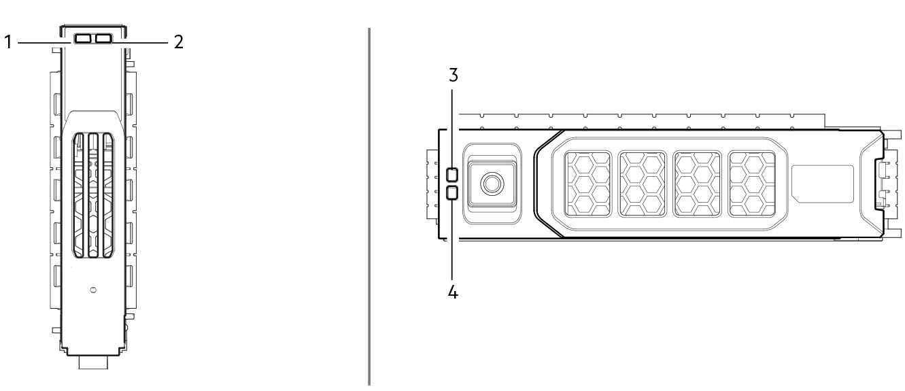

# Overview

!!! info

    The ME5 Series is a next gen entry-level block storage array that’s purpose-built and optimized for SAN/DAS simplicity and accelerated performance. It’s designed to meet the needs of the entry storage market, while also offering the flexibility to scale as needs grow.

    Resources:

    - [Owner's Manual](https://www.dell.com/support/manuals/en-us/powervault-me5024/me5_series_om/)
    - [Deployment Guide](https://www.dell.com/support/manuals/en-us/powervault-me5024/me5_series_dg/)
    - [Administrator's Guide](https://www.dell.com/support/manuals/en-us/powervault-me5024/me5_series_ag/)
    - [CLI Guide](https://www.dell.com/support/manuals/en-us/powervault-me5024/me5_series_cli/) 
    - [Best Practices Guide](https://www.delltechnologies.com/asset/en-us/products/storage/technical-support/h19551-dell-powervault-me5-series-storage-system-best-practices-wp.pdf)

??? info "PowerVault ME5 Series Terminology"

    `Customer Replaceable Unit (CRU)`

    :   Customer Replaceable Unit. A part that can be replaced by the customer.

    `Field Replaceable Unit (FRU)`

    :   Field Replaceable Unit. A part that requires service expertise from a Dell field technician.

    `Partner Firmware Update (PFU)`

    :   An option that automatically updates the firmware on the second controller module to match that on the first controller module.

    `Controller Module (CM)`

    :   A FRU that contains the following subsystems and devices: a Storage Controller processor; a Management Controller processor; a SAS expander and Expander Controller processor; management interfaces; cache protected by a super capacitorpack and non-volatile memory; host, expansion, network, and service ports; and midplane connectivity.

    `Storage Controller (SC)`

    :   Storage Controller. A processor (located in a controller module) that is responsible for RAID controller functions. The SC is also referred to as the RAID controller. See also EC, MC.

    `Management Controller (MC)`

    :   A processor (located in a controller module) that is responsible for human-computer interfaces, such as a WBI, and computer-computer interfaces, such as SNMP, and interacts with the Storage Controller.

    `Data Drive in Carriers (DDICs)`

    :   A DDIC consists of a disk drive that is installed in a carrier module. They are hot-swappable.

    `Input/Output Module (IOM)`

    :   An IOM is a module that provides connectivity to the enclosure. More specifically, they are referenced in Dell documentation as expansion enclosures.

    `Canister`

    :   Synonym for IOM.

    `Power Cooling Module (PCM)`

    :   A PCM is a module that provides power and cooling to the enclosure. It is a hot-swappable module.

---

## Front Panel

### DDICs

!!! info

    Integers on the disks indicate drive slot numbering sequence.

=== "1 & 4 Disk Activity LED"

    In normal operation, the green LED is on and flickers as the drive operates.

=== "2 & 3 Disk Fault LED"

    In normal operation, the amber LED is:

    - Off if there no drive present
    - Off as the drive operates
    - On if there is a drive fault

### Operator Panel LEDs

!!! info

    If the Ops panel Status/Health LED is amber, check the module LEDs on the enclosure rear panel to narrow the fault to a CRU, a connection, or both.

    See the [Troubleshooting](../powervault-me5/me5-troubleshooting.md) section for more information. 

=== "1. System Power"

    - **Constant green**: At least one PCM is supplying power.
    - **Off**: System not operating.

=== "2. Status/Health"

    - **Constant blue**: System is powered on and controller is ready.
    - **Blinking blue**: Controller management is busy.
    - **Constant amber**: Module fault present.
    - **Blinking amber**: Logical fault.

=== "3. Unit ID Display"

    - **Green dual seven-segment display**: Shows the numerical position of the enclosure in the cabling sequence. The UID (Unit ID Display) is also the enclosure ID.

=== "4. Identity"

    - **Blinking blue**: System ID locator is activated.
    - **Off**: Normal state

## Rear Panel

!!! info

    Controller modules, IOMs, and PCMs are available as CRUs.

### Controller enclosure (4-port SAS shown)

1. Power cooling module slot 0
2. Controller module A
3. Power cooling module slot 1
4. Controller module slot B

### Controller module (4-port SAS shown)

The top slot for holding controller modules is designated slot A and the bottom slot is designated slot B. The face plate details of the controller modules show the modules aligned for use in slot A. In this orientation, the controller module latch shown at the bottom of the module and it is in a closed/locked position. The following figures identify the ports on the controller modules.

1. Host ports
2. USB serial port (service only)
3. USB serial port (CLI)
4. Ethernet port for management network
5. SAS expansion port 

### Controller module LEDs

=== " Hardware Normal"

    - **Green**: Controller operating normally.
    - **Blinking green**: Booting.
    - **Off**: Controlller module power is off, offline, or has a fault condition.

=== " Hardware Fault"

    - **Off**: Controller operating normally.
    - **Amber**: Fault detected or service action required.

=== " OK to remove"

    - **Off**: Not prepared for removal, cache still contains data.
    - **White**: Controller module is prepared for removal, cache is clear.

=== " Identity"

    - **Blue**: Controller is being identified.

=== " Cache Status"

    - **Green**: Cache is dirty (contains unwritten data) and operation is normal.
    - **Slow flashing green**: Cache self-refresh in progress after flush
    - **Fast flashing green**: Cache is active, cache flush in progress.
    - **Off**: In a working controller, cache is clean (contains no unwritten data). This is an occasional condition that occurs while the system is booting.

=== " Management Port Link Active Status"

    - **Off**: Not connected or the link is down.
    - **Amber**: The Ethernet link is up

=== "**ACT** Management Port Activity"

    - **Off**: The link is down.
    - **Green**: The link is up.

=== " SAS Expansion Port Status"

    - **Off**: Not connected or link is down.
    - **Amber**: Connected, partial link is up.
    - **Green or Amber flashing**: Activity
    - **Green**: Connected, link is up.

### Power Cooling Module (PCM)

This example shows a PCM oriented for use in the left PCM slot of the enclosure rear panel.

1. PCM OK LED (Green)
2. AC Fail LED (Amber/blinking amber)
3. Fan Fail LED (Amber/blinking amber)
4. DC Fail LED (Amber/blinking amber)
5. On/Off switch
6. Power connector
7. Release latch

If any of the PCM LEDs are illuminated amber, a module fault condition or failure has occurred.