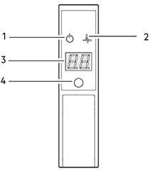
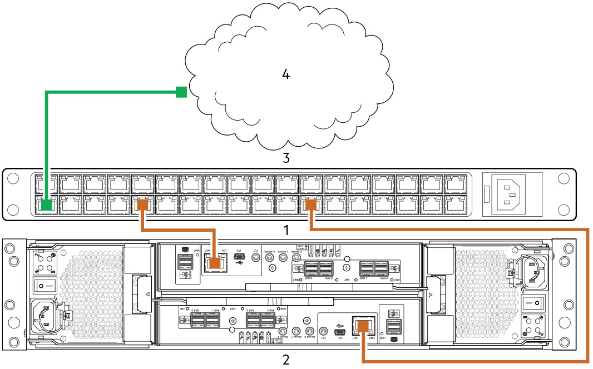
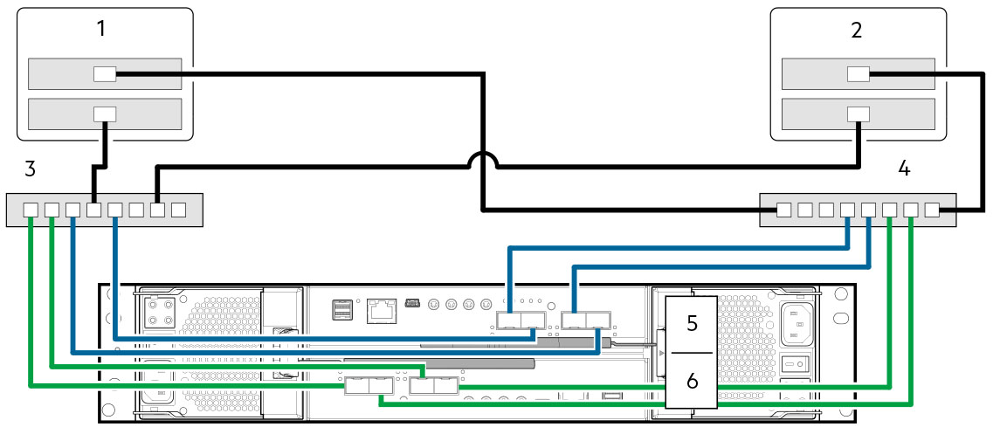
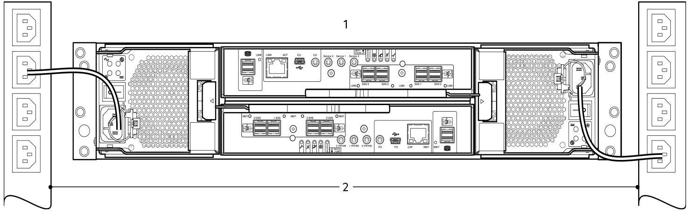

#

## PowerVault ME4 Series

!!! info

    The following notes/docs have been compiled from the following sources:

    - [PowerVault ME4 Owner's Manual](https://www.dell.com/support/manuals/en-us/powervault-me4012/me4_series_om_pub/)
    - [PowerVault ME4 Deployment Guide](https://www.dell.com/support/manuals/en-us/powervault-me4012/me4_series_dg_pub)
    - [PowerVault ME4 Administrator's Guide](https://www.dell.com/support/manuals/en-us/powervault-me4012/me4_series_ag_pub)
    - [PowerVault ME4 Series Storage System CLI Guide](https://www.dell.com/support/manuals/en-us/powervault-me4024/me4_series_cli_pub)

!!! Warning "Safe Operation"

    Operation of the enclosure with modules missing disrupts the airflow and prevents the enclosure from receiving sufficient cooling. For all 2U enclosures, all IOM and PCM slots must be populated. In addition, empty drive slots (bays) in 2U enclosures must hold blank drive carrier modules. For a 5U enclosure, all controller module, IOM, FCM, and PSU slots must be populated.

!!! Danger "Electrical Safety"

    - The 2U enclosure must be operated from a power supply input voltage range of 100–240 VAC, 50/60Hz.
    - The 5U enclosure must be operated from a power supply input voltage range of 200–240 VAC, 50/60Hz.
    - Provide a power source with electrical overload protection to meet the requirements in the technical specification.
    - The enclosure must be grounded before applying power.

??? info "PowerVault ME4 Series Terminology"

    `Customer Replaceable Unit (CRU)`

    :   Customer Replaceable Unit. A part that can be replaced by the customer.

    `Field Replaceable Unit (FRU)`

    :   Field Replaceable Unit. A part that requires service expertise from a Dell field technician.

    `Partner Firmware Update (PFU)`

    :   A setting that automatically updates the firmware on the second controller module to match that on the first controller module.

    `Converged Network Controller (CNC)`

    :   This technology allows you to select the host interface protocols to use on the storage system. The ME4 Series FC/iSCSI modules use SFP+ connectors in the CNC ports.

    `Storage Bridge Bay (SSB)`

    :   Storage Bridge Bay modules actively manage the enclosure. Each module has a SAS expander with its own storage enclosure processor (SEP).

    `Data Drive in Carriers (DDICs)`

    :   A DDIC consists of a disk drive that is installed in a carrier module. They are hot-swappable.

    `Input/Output Module (IOM)`

    :   An IOM is a module that provides connectivity to the enclosure. More specifically, they are referenced in Dell documentation as expansion enclosures.

    `Power Cooling Module (PCM)`

    :   A PCM is a module that provides power and cooling to the enclosure. It is a hot-swappable module.

### Front Panel LEDs

Located on the left side of the front panel.

1. System Power:
      1. Constant green: At least one PCM is supplying power.
      2. Off: System not operating.
2. Status/Health:
      1. Constant blue: System is powered on and controller is ready.
      2. Blinking blue: Controller management is busy.
      3. Constant amber: Module fault rpesent.
      4. Blinking amber: logical fault.
3. Unit ID Display: Green (seven-digit display: enclosure sequence)
4. Identity:
      1. Blinking blue: System ID locator is activated.
      2. Off: Normal state

### Deployment Brief

1. Unpack.
2. Install the controller enclosure and optional expansion enclosure in the rack.
3. Populate drawers with disks (DDICs). 2U encosures ship with disks installed.
4. Cable the optional expansion enclosures.
5. Connect the management ports.
6. Cable the controller host ports.
7. Connect the power cords and power on the system.
8. Perform system and storage setup.
9. Perform host setup.
   - Attach host servers.
   - Install required host software.
10. Perform the initial configuration tasks.

#### Connect the management ports

1. Connect an Ethernet cable to the network port on each controller module.
2. Connect the other end of each Ethernet cable to a network that your management host can access, preferably on the same subnet.

!!! note

    If you connect the iSCSI and management ports to the same physical switches, Dell recommends using separate VLANs.

#### Cable the controller host ports (iSCSI)

A host identifies an external port to which the storage system is attached. The external port may be a port in an I/O adapter (such as an FC HBA or ethernet NIC) in a server.

!!! note

    - Controller modules are not always shipped with preinstalled SFP+ transceivers. You might need to install SFP transceivers into the controller modules.
    - Use the PowerVault Manager to set the host interface protocol for CNC ports using qualified SFP+ transceivers. ME4 Series modules ship with CNC ports configured for FC, so you must configure these port for iSCSI when connecting to iSCSI hosts.
    - If you are using switches with mixed traffic (LAN/iSCSI), then a VLAN should be created to isolate iSCSI traffic from the rest of the switch traffic.

To connect controller modules supporting 10 GbE iSCSI host interface ports to a server HBA or switch, using the controller CNC ports, select a qualified 10 GbE SFP+ transceiver. Use the cabling diagram below to connect the host servers to the switches.

#### Connecting the power cords and power on the system

Connect the power cable from each PCM on the enclosure rear panel to the power distibution unit as shown below:

- Power on the storage system by connecting the power cables from the PCMs to the PDU, and moving the power switch on each PCM to the On posisition.
    - With 2U enclosures, the System Power LED on the 2U Ops panel lights green when the enclosure power is activated.
- When powering up, ensure to power up the enclosures and associated data host in the following order:
    1. Drive enclosures—Ensures that the disks in the drive enclosure have enough time to completely spin up before being scanned by the controller modules within the controller enclosure. The LEDs blink while the enclosures power up. After the LEDs stop blinking the power-on sequence is complete. If the LEDs on the front and back of the enclosure are amber then a fault has been detected.
    2. Controller enclosure—Depending upon the number and type of disks in the system, it may take several minutes for the system to become ready.
    3. Data host—if powered off for maintenance purposes.
- When powering off, reverse the order of steps that are used for powering on.

#### Perform system and storage setup (guided)

Upon completing the hardware installation, use PowerVault Manager to configure, provision, monitor and manage the storage system. When first accessing the PowerVault Manager, perform a firmware update before configuring your system. After the firmware update is complete, use the guided setup to verify the web browser requirements and then access the PowerVault Manager.

!!! note

    Not sure if this is still true, but the Dell docs say you cannot view PowerVault Manager Help content if you are using the Microsoft Edge browser that ships with Windows 10.

Accessing the PowerVault Manager:

1. Temporarily set the management host NIC to a 10.0.0.x address or to the same IPv6 subnet to enable communication with the storage system.
2. In a supported web browser, type `https://10.0.0.2` to access controller module A on an IPv4 network.
3. If the storage system is running G275 firmware:
      1. Sign in to the PowerVault Manager using the following user name and password:
         - Username: `manage`
         - Password: `!manage`
      2. Read and accept the Commercial Terms of Sale and End User License Agreement.
4. If the storage system is running G280 firmware:
      1. Click *Get Started*.
      2. Read and accept the Commercial Terms of Sale and End User License Agreement.
      3. Type a new user name for the storage system in the *Username* field.
      4. Type password for the new username in the Password and Confirm Password fields.
      5. Click Apply and Continue.

Update the firmware:

1. Using the PowerVault Manager, select Action > Update Firmware in the System topic.
2. Locate firmware updates at <https://www.dell.com/support>. If newer versions are vailable, download the bundle file or relevant firmware components.
3. Click *Browse*, select the firmware bundle file or component file, and click *OK*.

Use guided setup:

The *Welcome* panel provides topions for you to quickly set up your system by guiding you through the configuration and provisioning process.

1. Access the *System Settings* panel and complete all the required options.
2. Save your settings and exit to the *Welcome* panel.
3. Access the *Storage Setup* panel and follow the prompts to begin provisioning your system by creating disk groups and pools.
4. Save your settings and exit to the *Welcome* panel.
5. Access the *Host Setup* panel and follow the promptsto continue provisioning your system by attaching hosts.