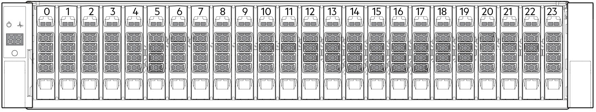
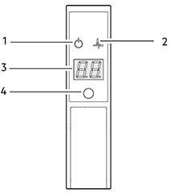
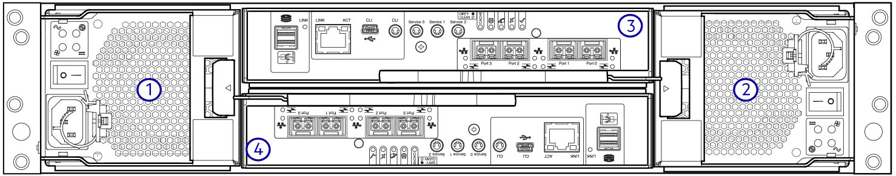
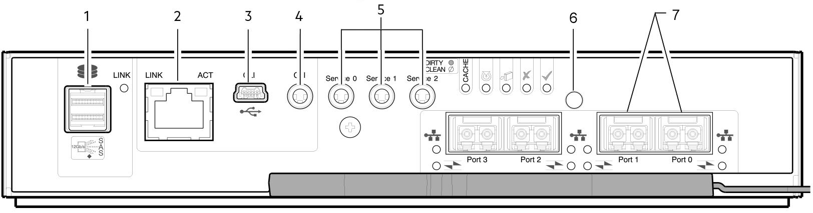
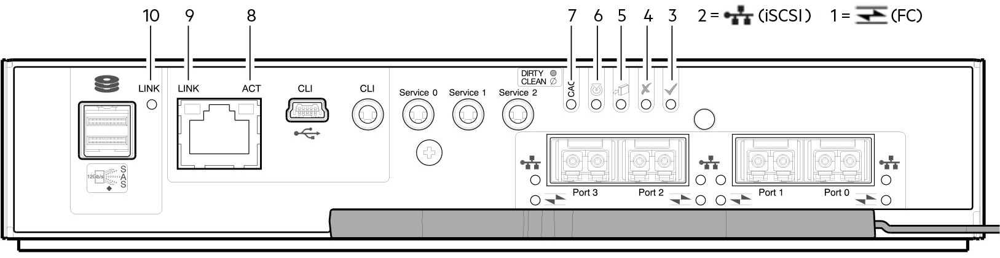

# PowerVault ME4024

!!! info

    The ME4 series storage system has four different manuals that sometimes cross reference each other (e.g. - The owner's manual or deployment guide may call for you to reference the adminitrator's or CLI guide to complete a particular task). The objective of this document is to avoid the timesink & confusion that may bring during initial deployment by consolidating all relevant information into a single source of truth.

    - [PowerVault ME4 Owner's Manual](https://www.dell.com/support/manuals/en-us/powervault-me4012/me4_series_om_pub/)
    - [PowerVault ME4 Deployment Guide](https://www.dell.com/support/manuals/en-us/powervault-me4012/me4_series_dg_pub)
    - [PowerVault ME4 Administrator's Guide](https://www.dell.com/support/manuals/en-us/powervault-me4012/me4_series_ag_pub)
    - [PowerVault ME4 Series Storage System CLI Guide](https://www.dell.com/support/manuals/en-us/powervault-me4024/me4_series_cli_pub)

!!! Warning "Safe Operation"

    Operation of the enclosure with modules missing disrupts the airflow and prevents the enclosure from receiving sufficient cooling. For all 2U enclosures, all IOM and PCM slots must be populated. In addition, empty drive slots (bays) in 2U enclosures must hold blank drive carrier modules. For a 5U enclosure, all controller module, IOM, FCM, and PSU slots must be populated.

!!! Danger "Electrical Safety"

    - The 2U enclosure must be operated from a power supply input voltage range of 100–240 VAC, 50/60Hz.
    - The 5U enclosure must be operated from a power supply input voltage range of 200–240 VAC, 50/60Hz.
    - Provide a power source with electrical overload protection to meet the requirements in the technical specification.
    - The enclosure must be grounded before applying power.

??? info "PowerVault ME4 Series Terminology"

    `Customer Replaceable Unit (CRU)`

    :   Customer Replaceable Unit. A part that can be replaced by the customer.

    `Field Replaceable Unit (FRU)`

    :   Field Replaceable Unit. A part that requires service expertise from a Dell field technician.

    `Partner Firmware Update (PFU)`

    :   A setting that automatically updates the firmware on the second controller module to match that on the first controller module.

    `Converged Network Controller (CNC)`

    :   This technology allows you to select the host interface protocols to use on the storage system. The ME4 Series FC/iSCSI modules use SFP+ connectors in the CNC ports.

    `Storage Bridge Bay (SSB)`

    :   Storage Bridge Bay modules actively manage the enclosure. Each module has a SAS expander with its own storage enclosure processor (SEP).

    `Data Drive in Carriers (DDICs)`

    :   A DDIC consists of a disk drive that is installed in a carrier module. They are hot-swappable.

    `Input/Output Module (IOM)`

    :   An IOM is a module that provides connectivity to the enclosure. More specifically, they are referenced in Dell documentation as expansion enclosures.

    `Power Cooling Module (PCM)`

    :   A PCM is a module that provides power and cooling to the enclosure. It is a hot-swappable module.

## Front Panel

### DDICs

!!! info

    Integers on the disks indicate drive slot numbering sequence.



### Operator Panel LEDs



=== "1. System Power"

    - **Constant green**: At least one PCM is supplying power.
    - **Off**: System not operating.

=== "2. Status/Health"

    - **Constant blue**: System is powered on and controller is ready.
    - **Blinking blue**: Controller management is busy.
    - **Constant amber**: Module fault rpesent.
    - **Blinking amber**: Logical fault.

=== "3. Unit ID Display"

    - **Green seven-digit display**: Enclosure sequence

=== "4. Identity"

    - **Blinking blue**: System ID locator is activated.
    - **Off**: Normal state

## Rear Panel

!!! info

    Controller modules, IOMs, and PCMs are available as CRUs.

### Controller enclosure (4-port FC/iSCSI)



1. Power cooling module slot 0
2. Power cooling module slot 1
3. Controller module slot A
4. Controller module slot B

### Controller module (4-port FC/iSCSI)

The top slot for holding controller modules is designated slot A and the bottom slot is designated slot B. The face plate details of the controller modules show the modules aligned for use in slot A. In this orientation, the controller module latch shown at the bottom of the module and it is in a closed/locked position. The following figures identify the ports on the controller modules.



1. Back-end expansion SAS port
2. Ethernet port used by management interfaces
3. USB serial port (CLI)
4. 3.5 mm serial port (CLI)
5. 3.5 mm serial ports (service only)
6. Reset
7. CNC ports (ports 3, 2, 1, 0)

### Controller module LEDs



=== "1. Link Status/Activity for host 4/8/16 Gb FC"

    - **Off**: No link.
    - **Green**: Port connected and the link is up.
    - **Blinking green**: I/O activity.

=== "2. Link Status/Activity 10GbE iSCS"

    - **Off**: No link.
    - **Green**: Port connected and the link is up.
    - **Blinking green**: I/O activity.

=== "3. OK"

    - **Green**: Controller operating normally.
    - **Blinking green**: Booting.
    - **Off**: Controlller not, or is powered off.

=== "4. Fault"

    - **Off**: Controller operating normally.
    - **Amber**: Fault detected or service action required.
    - **Blinking amber**: Hardware-controlled power-up or a cache flush or restore error.

=== "5. OK to remove"

    - **Off**: Not prepared for removal.
    - **Blue**: Controller module is prepared for removal.

=== "6. Identity"

    - **White**: Controller is being identified.

=== "7. Cache Status"

    - **Green**: Cache is dirty (contains unwritten data) and operation is normal.
    - **Off**: In a working controller, cache is clean (contains no unwritten data). This is an occasional condition that occurs while the system is booting.
    - **Blinking green**: A CompactFlash flush or cache self-refresh is in progress, indicating cache activity.

=== "8. Network Port Link Active Status"

    - **Off**: The Ethernet link is not established, or the link is down.
    - **Green**: The Ethernet link is up

=== "9. Network Port Link Speed"

    - **Off**: Link is up at 10/100 base-T negotiated speeds.
    - **Amber**: Link is up and negotiated at 1000 base-T.

=== "10. Expansion Port Status"

    - **Off**: The port is empty or the link is down.
    - **Green**: The port is connected and the link is up.

## Deployment Brief

!!! info "Required Tools"

    - Phillips screwdriver
    - Torx T20 bit for locks

- [ ] Unpack.
- [ ] Install the controller enclosure and optional expansion enclosure in the rack.
- [ ] Populate drawers with disks (DDICs). 2U encosures ship with disks installed.
- [ ] Cable the optional expansion enclosures.
- [ ] Connect the management ports.
- [ ] Cable the controller host ports.
- [ ] Connect the power cords and power on the system.
- [ ] Perform system and storage setup.
- [ ] Perform host setup.
      - [ ] Attach host servers.
      - [ ] Install required host software.
- [ ] Perform the initial configuration tasks.

### Connect the management ports

1. Connect an Ethernet cable to the network port on each controller module.
2. Connect the other end of each Ethernet cable to a network that your management host can access, preferably on the same subnet.


1. Controller module in Slot A
2. Controller module in Slot B
3. Switch
4. SAN

!!! note

    See also the topic about configuring network ports on controller modules under ["Accessing the CLI"](#accessing-the-cli).

### Cable the controller host ports (iSCSI)

A host identifies an external port to which the storage system is attached. The external port may be a port in an I/O adapter (such as an FC HBA or ethernet NIC) in a server.

!!! note

    - Controller modules are not always shipped with preinstalled SFP+ transceivers. You might need to install SFP transceivers into the controller modules.
    - Use the PowerVault Manager to set the host interface protocol for CNC ports using qualified SFP+ transceivers. ME4 Series modules ship with CNC ports configured for FC, so you must configure these ports for iSCSI when connecting to iSCSI hosts.
    - If you are using switches with mixed traffic (LAN/iSCSI), then a VLAN should be created to isolate iSCSI traffic from the rest of the switch traffic.

To connect controller modules supporting 10 GbE iSCSI host interface ports to a server HBA or switch, using the controller CNC ports, select a qualified 10 GbE SFP+ transceiver.

Use the cabling diagram below to connect host servers to a switch-attached storage system.


### Connecting the power cords and powering on the system

Connect the power cable from each PCM on the enclosure rear panel to the power distibution unit as shown below:


- Power on the storage system by connecting the power cables from the PCMs to the PDU, and moving the power switch on each PCM to the On posisition.
    - With 2U enclosures, the System Power LED on the 2U Ops panel lights green when the enclosure power is activated.
- When powering up, ensure to power up the enclosures and associated data host in the following order:
    1. Drive enclosures—Ensures that the disks in the drive enclosure have enough time to completely spin up before being scanned by the controller modules within the controller enclosure. The LEDs blink while the enclosures power up. After the LEDs stop blinking the power-on sequence is complete. If the LEDs on the front and back of the enclosure are amber then a fault has been detected.
    2. Controller enclosure—Depending upon the number and type of disks in the system, it may take several minutes for the system to become ready.
    3. Data host—if powered off for maintenance purposes.
- When powering off, reverse the order of steps that are used for powering on.

### Perform system and storage setup (guided)

!!! tip "System Information Worksheet"

    Use the System Information Worksheet found on page 100 of the deployment guide to record the information that you need to install the ME4 Series storage system.

Upon completing the hardware installation, use PowerVault Manager to configure, provision, monitor and manage the storage system. When first accessing the PowerVault Manager, perform a firmware update before configuring your system. After the firmware update is complete, use the guided setup to verify the web browser requirements and then access the PowerVault Manager.

!!! note

    Not sure if this is still true, but the Dell docs say you cannot view PowerVault Manager Help content if you are using the Microsoft Edge browser that ships with Windows 10.

Accessing the PowerVault Manager:

1. Temporarily set the management host NIC to a 10.0.0.x address or to the same IPv6 subnet to enable communication with the storage system.
      - **Note**: If the default IP addresses (10.0.0.2 - Controller A, 10.0.0.3 - Controller B) are not compatible with your network, refer to ["Accessing the CLI"](#accessing-the-cli) to learn how to set the network port IP addresses.
2. In a supported web browser, type `https://10.0.0.2` to access controller module A on an IPv4 network.
3. If the storage system is running G275 firmware:
      1. Sign in to the PowerVault Manager using the following user name and password:
         - Username: `manage`
         - Password: `!manage`
      2. Read and accept the Commercial Terms of Sale and End User License Agreement.
4. If the storage system is running G280 firmware:
      1. Click *Get Started*.
      2. Read and accept the Commercial Terms of Sale and End User License Agreement.
      3. Type a new user name for the storage system in the *Username* field.
      4. Type password for the new username in the Password and Confirm Password fields.
      5. Click Apply and Continue.

Update the firmware:

1. Using the PowerVault Manager, select Action > Update Firmware in the System topic.
2. Locate firmware updates at <https://www.dell.com/support>. If newer versions are vailable, download the bundle file or relevant firmware components.
3. Click *Browse*, select the firmware bundle file or component file, and click *OK*.

Use guided setup:

The *Welcome* panel provides options for you to quickly set up your system by guiding you through the configuration and provisioning process.

1. Access the *System Settings* panel and complete all the required options.
2. Save your settings and exit to the *Welcome* panel.
3. Access the *Storage Setup* panel and follow the prompts to begin provisioning your system by creating disk groups and pools.
4. Save your settings and exit to the *Welcome* panel.
5. Access the *Host Setup* panel and follow the prompts to continue provisioning your system by attaching hosts.

## Accessing the CLI

Embedded within the controller modules is a command-line interface (CLI) that enables you to manage and monitor the storage system. The CLI can be accessed in two ways:

- Use SSH or Telnet on a management host that is remotely connected to a controller module network port through a LAN.
- Use a serial cable to establish a serial connection from a computer to the CLU port on a controller module. Refer back to the [controller module rear panel diagram](#controller-module-4-port-fciscsi) for the location of the CLI ports.

If the default IP addresses (10.0.0.2 - Controller A, 10.0.0.3 - Controller B) are not compatible with your network, you must set an IP addresses for each network port using the CLI.

1. Obtain an IP address, subnet mask and gateway from your network administrator.
2. Connect the provided 3.5mm/DB9 serial cable from a host computer with a serial port to the 3.5mm stereo plug CLI port on controller A. Alternatively, connect a generic mini-USB cable from a host computer to the USB CLI port on controller A.
3. Start a terminal emulator configured to use the following display and connection settings:
    1. Display Settings:
          - **Terminal emulation mode** - VT-100 or ANSI (for color support)
          - **Font** - Terminal
          - **Translations** - None
          - **Columns** - 80
    2. Connection Settings:
          - **Connector** - COM3
          - **Baud rate** - 115,200
          - **Data bits** - 8
          - **Parity** - None
          - **Stop bits** - 1
          - **Flow control** - None
4. Press `Enter` to display prompt if necessary.
5. If you are connecting to a storage system with G275 firmware that has not been deployed, the default user/pass is `manage`/`!manage`. If your system has been deployed, login with a user that has the *manage* role.
6. If you are connecting to a storage system with G280 firmware that has not been deployed, type `setup` at the login prompt and press `Enter`. Do not type anything at the password prompt and press `Enter`. If your system has been deployed, login with a user that has the *manage* role.

### Setting the Network port IP addresses (DHCP)

!!! info

    In DHCP mode, the network port IP address, subnet mask, and gateway are obtained from a DCHP server. If a DHCP server is not available, the current network addresses are not changed. To determine the addresses that are assigned to the controller modules, use the list of bindings on the DHCP server.

To obtain an IP address via DHCP, use the `set network-parameters dhcp` command.

### Setting the Network port IP addresses (Static)

To use a custom static IP address, use the `set network-parameters ip address netmask netmask gateway gateway controller a|b` command.

Where:

- address is the IP address of the controller module
- netmask is the subnet mask
- gateway is the IP address of the subnet router
- a|b specifies the controller whose network parameters you are setting

!!! info

    Run the command for controller module A first, and then for controller module B.

    Example:
    ```shell
    set network-parameters ip 192.168.0.10 netmask 255.255.255.0 gateway 192.168.0.1 controller a
    set network-parameters ip 192.168.0.11 netmask 255.255.255.0 gateway 192.168.0.1 controller b
    ```

### Verifying the new IP addresses and connectivity

Show the IP address, subnet mask and gateway of a controller module: `show network-parameters`

Ping an address, such as the gateway: `ping 192.168.0.1`

From another host, ping the controllers . . .

!!! note

    If you can't access your storage system for at least three minutes after changing the IP address, restart the controllers using the CLI command `restart mc both`.

!!! warning "Caution"

    When configuring an iSCSI storage system or a storage system that uses a combination of Fibre Channel and iSCSI SFPs, do not restart the Management Controller or exit the terminal emulator session until the CNC ports are configured as described "[Changing the host port settings](https://www.dell.com/support/manuals/en-us/powervault-me4012/me4_series_dg_pub/changing-host-port-settings?guid=guid-4b22aaaa-ca95-4d45-82cd-a3499bb1890c&lang=en-us)".

    Note: I would assume that this step is covered in the "[Perform system and storage setup](#perform-system-and-storage-setup-guided)" process (Guided setup - System Settings). 

    The Dell docs do not explain the reason for precaution btw . . .
