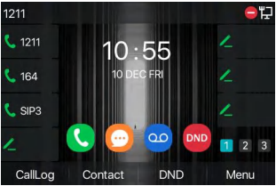
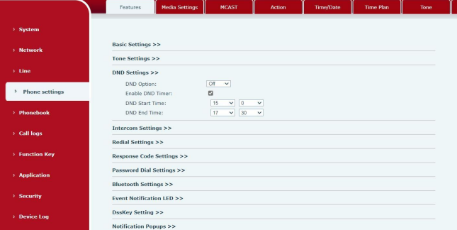

# Fanvil v64

## Do not Disturb

Users may enable Do-Not-Disturb (DND) feature on the device to reject incoming calls (including call waiting). DND mode is indicated by a red circle with a white horizontal line in the upper right oif the display.

Via phone interface:

1. Press **DND** button to enter the DND setting interface, select line or phone to enable DND.
2. Press **DND** button to enter the DND setting interface and disable DND.

Via web interface:

Enter **Phone Settings** > **Features** > **DND Settings**

