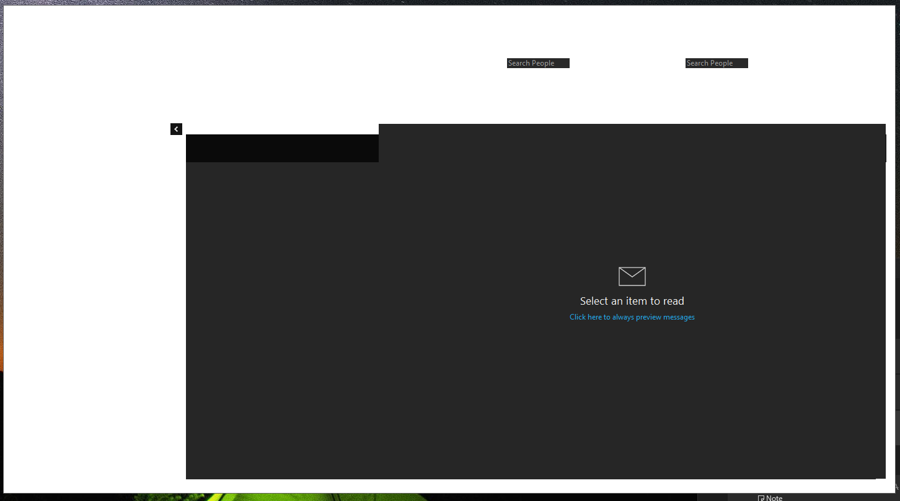

# Outlook <small>(Classic)</small>

## Register Missing Teams Meeting Add-in

Resolve missing "New Items > Teams Meeting" in Outlook. This appears to happen after installing the "new" Teams app.

1. Close Outlook
2. Open "Installed Apps" (Win11) or "Apps & Features" (Win10) in Settings and search for "Teams"
3. Uninstall the classic version (if installed)
      - Note: The "new" version should be called "Microsoft Teams (work or school)". Don't remove that.
4. Repair the "Microsoft Teams Meeting Add-in" by clicking it and then Modify
      - Note: If it complains that the add-in installer doesn't exist, reinstall Teams from the Microsoft website.
5. Run Outlook
6. Open the COM add-ins window in Outlook (File > Options > Add-ins > Go)
7. Check the box for "TeamsAddin.FastConnect"
      - Note: If the box was already checked: uncheck it, click Ok, open add-ins again, check the box, and click Ok.
8. "Teams Meeting" should now be listed under the "New Items" menu.
Note: It takes a 5-10 seconds for the meeting code to be generated.

## Prevent Meeting Requests From Being Deleted After Responding

By default, Outlook will automatically delete meeting requests from your inbox after responding. To prevent this, follow these steps:

1. Open Outlook & click on the **File** > **Options**
2. In the Outlook Options dialog box, click **Mail** in the left pane, and then uncheck the option "*Delete meeting requests and notifications from Inbox after responding*" in the **Send Messages** section.
3. Click **OK**.

## Safe Mode

To launch Outlook in safe mode, hold the **Ctrl** key while clicking the Outlook shortcut. This will launch Outlook in safe mode.

## Export Outlook Data to .pst file

!!! tip

    Multiple PST files can be imported at the same time to different associated Exchange Online archive mailboxes in one shot using a mapping file.

    <https://learn.microsoft.com/en-us/purview/importing-pst-files-to-office-365>

1. At the top of the ribbon in classic Outlook, click **File**.
2. Click **Open & Export** > **Import/Export**.
3. Click **Outlook Data File (.pst)** > **Next**.
4. Select the name of the account to export and make sure that **Include subfolders** is ticked. Click **Next**.
    - Alternatively, you can choose select folders/items if you do not wish to export all of your data.
5. Choose where to save the .pst file, enter a file name, and click **OK**.
6. Click **Finish**.

### Filter by date range

Complete steps 1-4 above, then:

1. Click on **Filter**.
2. Select the **Advanced** tab.
3. From the **Field** dropdown, select **All Mail fields** > **Received**.
4. Choose **between** from the **Condition** dropdown.
5. Type a date range into the box and click **Add to List**.
    - **Example**: `01/01/2024 and 12/31/2024` (Yes, you are actually typing the word "and" in between the two dates.)
6. Click **OK** > **Next**.
7. Choose where to save the .pst file, enter a file name, and click **OK**.
8. Click **Finish**.

## Remove Saved Credentials

This has been found to resolve the following issues:

- When prompted to enter credentials where multiple accounts are set up in Outlook, the wrong credentials are entered and saved. Outlook will fail to sync with the server and will not prompt for the correct credentials again.
- The Global Address List (GAL) is not updating in Outlook.

!!! note "4/22/25"

    When Matthew used this method to resolve the GAL issue for a few users, he was not prompted for credentials after restarting Outlook. Not sure why that was, but Outlook continued to work without issues.

1. Open **Control Panel** > **User Accounts** > **Credential Manager**
2. Look for and remove the **MicrosoftOffice16_Data** entry under **Windows Credentials**.
3. Restart Outlook and enter your credentials when prompted.

## Outlook Mobile App

### Add Email Account <small>(Exchange)</small> 

1. Open the Outlook Mobile App
2. If it's your first time launching the app, tap **Get Started** and then **Skip**. Otherwise, tap **Menu** > **Settings** > **Add Account**.
3. Enter your company email address and select **Continue**.
4. Select **Exchange**.
5. Enter your password and a description for the account.
6. Select the **Advanced Settings** toggle at the bottom right of the screen.
7. Ensure that `mail.northeastprecast.com` is entered in the **Server** field.
8. Leave the **Domain** field blank and enter your full email address in the **Username** field.
9. Tap the checkmark in the top right corner to finish.

## Issues 

### Mailbox Disconnected

After adding a second mailbox to Outlook, my main mailbox would not connect to exchange. Tried some of the methods in the NEP docs, but here is what worked for me:

1. Control Panel > User Accounts > Mail
2. Open "Data Files"
3. Create new data file
4. Select "Email tab" and delete all email accounts
5. Re-add email accounts from same tab by selecting "new".
6. Relaunch Outlook and sign in when prompted.

### UI Rendering Issues

I have experienced strange rendering issues with Outlook from time to time. For a while I was relaunching the app to resolve it, but I discovered that reloading the system's graphics drivers with <kbd>Win</kbd>+<kbd>Ctrl</kbd>+<kbd>Shift</kbd>+<kbd>B</kbd> also resolves the issue without having to close Outlook.

### "Incorrect Log in"

I was assisting a user add their work email to the Outlook mobile app on their new Android phone, but kept getting the error "Incorrect log in" (or something very similar, I can't remember the exact wording). I knew that the credentials were correct because I had them log in to OWA without issue. The following steps resolved the issue:

1. Android Settings > Applications > Outlook
2. Open Storage and Cache, clear both.
3. Go back and force stop the app.
4. Add the mail account to Outlook again.